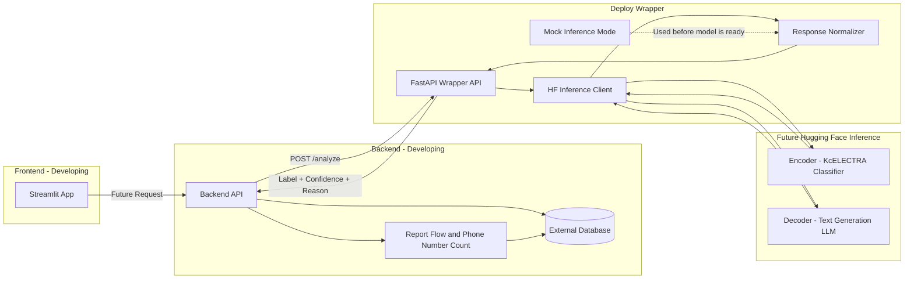

# Deployment Architecture

이 문서는 최종 목표인 B안 구조를 기준으로 전체 서비스 흐름을 설명한다.

현재는 프론트엔드, 백엔드, 모델이 개발 중이므로 `Mock Inference Mode`를 먼저 사용한다. 모델 학습과 Hugging Face serverless API 또는 dedicated Inference Endpoint 준비가 끝나면 환경변수만 교체하여 `hf_endpoint` mode로 전환하는 것을 목표로 한다.

## Target Flow

1. Streamlit frontend가 backend API를 호출한다.
2. Backend API가 deploy wrapper의 `POST /analyze`를 호출한다.
3. deploy wrapper FastAPI app이 현재 serving mode를 확인한다.
4. `AI_SERVICE_MODE=mock`이면 mock inference 결과를 반환한다.
5. `AI_SERVICE_MODE=hf_endpoint`이면 Hugging Face Encoder/Decoder inference API를 호출한다.
   - `HF_SERVING_TYPE=endpoint`: HF Endpoint 또는 Space API URL 호출
   - `HF_SERVING_TYPE=serverless`: model ID 기반 serverless API 호출
6. Encoder는 피싱 분류 label과 confidence를 반환한다.
7. Decoder는 dedicated endpoint 또는 Inference Providers chat completion으로 explanation/reason을 생성한다.
8. deploy wrapper가 응답을 정규화해 backend에 반환한다.
9. Backend가 결과를 DB에 저장하고 frontend에 전달한다.
10. 사용자가 신고를 누르고 전화번호가 입력된 경우, frontend/backend가 신고 안내 흐름과 전화번호 신고 횟수 저장을 처리한다.

## Current Assumption

- 모델은 아직 학습 중이다.
- 실제 HF Endpoint URL은 모델팀이 공유하면 `deploy/.env` 또는 secret으로 연결한다.
- DB와 backend schema는 확정 전이다.
- 따라서 API 응답 필드와 mock mode를 먼저 고정해 병렬 개발이 가능하게 한다.
- `ai_service/`는 모델링 담당자 영역이므로 deployment wrapper 코드는 `deploy/app/`에 둔다.
- deploy wrapper는 `text`만 분석하고, `phone_number`와 신고 DB 관리는 backend 영역으로 둔다.
